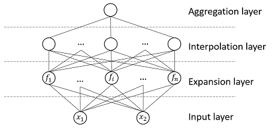
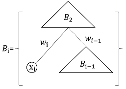

# BaconNet

**BaconNet** is a neural network architecture for building fully explainable neural network for arithmetic and gradient logic expression approximation. A BaconNet network can be used to discover an arithmetical or a logical expression that approximates the given dataset. And the result network is precisely explainable.

This repository contains a series of 2-variable BaconNet implementations. Multiple BaconNet can be used together to expand the search space; And BaconNet can be stacked into a **BaconStack** that handles arbitrary number of variables.

The following table presents a list of famous formulas in different fields that are re-discovered using Bacon-Net using synthetic training data. All networks in this repository are implemented using [Keras](https://keras.io/) and Python.

| Expression | BaconNet variation |
| ---------- | ------------------ |

## Installation

Run the following command to install:

```python
pip install baconnet
```

## Usage

```python
from baconnet import poly2

print(predict(DATA).exp())
```

# Developing BaconNet

To install baconnet, along with the tools you need to develop and run tests, run the following command:

```python
pip install -e .[dev]
```

## BaconNet Architecture

The idea behind BaconNet is simple: to construct a network that can do linear interpolation among a group of selected simple expressions like _min(x,y)_ and _sin(x^2)_, as shown in the following diagram:



- **Input layer** contains two variables. For gradient logic expressions, the inputs are expected to be normalized to I=[0,1].
- **Expansion layer** defines the search space. Each node in this layer represents a candidate expression for the final approximation. Obviously, it’s desirable to have minimum overlaps among the function curves.

- **Interpolation layer** creates a linear interpolation of candidate terms from the expansion layer by adjusting weights associated with candidates.

- **Aggregation layer** calculate the interpolation result, which is compared to the training data.

## BaconStack Architecture

A BaconStack is recursively defined: a BaconStack that handles _n_ variables (denoted as _B(n)_) is constructed by feeding variable _x(i)_ and the result of a _B(n-1)_ into a _B(2)_ network, which is a BaconNet, as shown in the following diagram:



## Try out BaconNet

TBD

## Why the name "BACON"?

When I was in high school in encountered with a BASIC algorithm that used a brute-force method to discover a arithmetical expression to approximate a given dataset. I remembered the program was called “BACON”. However, it’s been unfruitful to find such references in Internet, so my memory may have failed me. Regardless, I’ve been wanting to recreate “BACON” all these years, and I finally get around to do it just now.

As I research into explainable AI, I see an opportunity to combine “BACON” with AI so that we can build some precisely explainable AI networks, plus the benefit of implementing a parallelable BACON using modern technologies.
