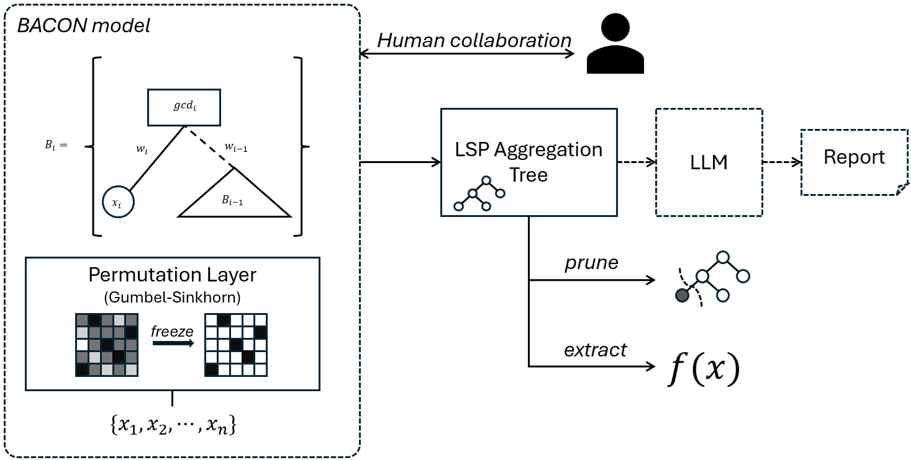

# BACON

BACON is an end-to-end explainable AI model that offers full transparency in automated decision-making processes. It employs [Graded Logic](https://link.springer.com/book/9783031885570) to construct an aggregation tree that reveals how inputs are combined into a final output across various scenarios, including purchasing a house, selecting a vendor, making a medical diagnosis, or determining actions for a humanoid.

The BACON architecture is built from the ground up to support explainability. It includes a permutation layer that explores possible input orderings (since commutativity is not assumed), and an aggregation layer that merges inputs based on a logical model such as the [Logic Scoring of Preference (LSP) method](https://books.google.com/books/about/Soft_Computing_Evaluation_Logic.html?id=PgtuDwAAQBAJ). The resulting model is fully explainable, highly precise, and efficient for inference.



## Benefits
* **End-to-end explainability** — BACON offers complete transparency throughout the decision-making pipeline. It not only identifies which features contributed to a decision (feature attribution) but also reveals how those features were logically aggregated. Additionally, the model provides tunable parameters that allow practitioners to adjust the behavior of the model based on human judgment or policy needs.

* **Human-AI collaboration** — BACON is designed for interpretability at every level, allowing human experts to inspect internal logic, validate reasoning paths, and contribute domain expertise during training. This collaborative loop improves trust, enables targeted refinements, and supports applications where human oversight is critical, such as healthcare, law, and safety-critical systems.

* **Extremely lightweight** — the BACON model can be trimmed and distilled into simple functions that run without any AI frameworks, making it ideal for resource-constrained and cost-sensitive scenarios such as tiny edge devices, real-time detection systems, drones, and robotics.

## Getting Started
To begin, try the [Hello, World sample](./samples/hello-world/README.md), which uses BACON to discover a randomly generated classic Boolean expression (e.g., A and B or C) from synthetic data.

To use BACON in your own program, note that it is implemented as a Python module built on top of PyTorch. Before the package is officially published, you can clone this repository and reference the module via a local path:

```python
import sys
sys.path.append('<path to the bacon folder under this repo>')

from bacon.baconNet import baconNet
from bacon.visualization import print_tree_structure
from bacon.utils import generate_classic_boolean_data
```

## Samples

* [**Hello, World!**](./samples/hello-world/README.md)

  Discover classic Boolean expression from synthetic data. 

## Resources

* [BACON Documentation](./docs/build/index.html)